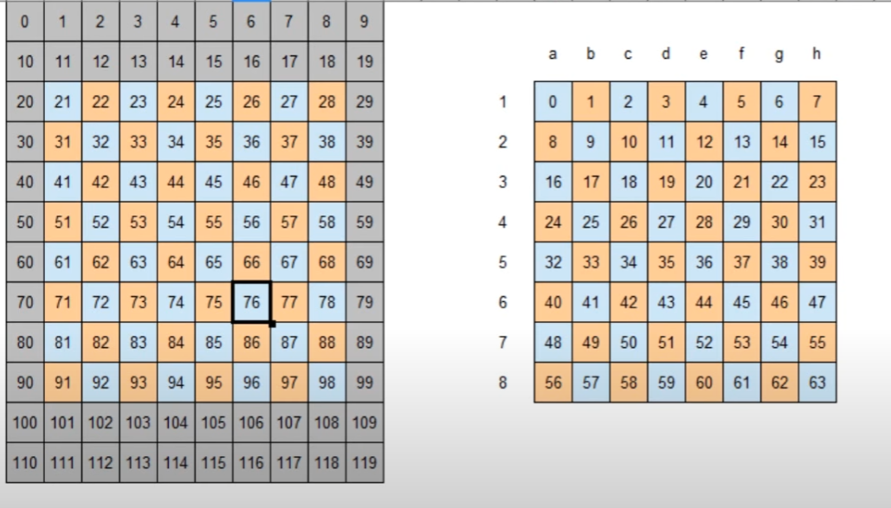

# Chess Engine Notes
These notes are basically just for myself to keep up and understand some of the functions and algorithims used in the Chess engine, sort of like a doccumentation, but for myself because I'm sure I'll begin to forget things as things become more complicated.

## Pawn Bitboards
Bitboards are a 64-bit unsigned value, where each bit corresponds to if there is a pawn present on that square or not. For example, a starting position would look like:
```bin
0 0 0 0 0 0 0 0
1 1 1 1 1 1 1 1
0 0 0 0 0 0 0 0
0 0 0 0 0 0 0 0
0 0 0 0 0 0 0 0
0 0 0 0 0 0 0 0 
1 1 1 1 1 1 1 1
0 0 0 0 0 0 0 0 
```
Since there are pawns on the 2nd and 7th rank, all bits in that rank are 1s, and no other pawns exist so the rest of them are zero. These bitboards work on a 64-index, so the number 0 corresponds to the A1 square.

### SETBIT and CLRBIT, SetMask and ClearMask

SetMask and ClearMask are two arrays of 64 Unsigned 64 bit numbers (U64), essentially 64 bitboards. At each index, the SetMask contains a bitboard with a pawn at that index. For example, SetMask[0] is a bitboard with a pawn on A1. The ClearMask is just the opposite of SetMask, so ClearMask[0] contains a bitboard with a pawn everywhere but A1. These two arrays are initialized in the init.c file. 

The SETBIT and CLRBIT macros, defined in defs.h, just use an AND or OR bitwise operator respectively to combine the mask at a given square with a given bitboard. This has the effect of adding or removing a pawn from the bitboard. For example with setmask:
Bitboard:
```bin
0 0 0 0 0 0 0 0        0 0 0 0 0 0 0 0    0 0 0 0 0 0 0 0
0 0 1 0 0 0 0 0        0 0 0 0 0 0 0 0    0 0 1 0 0 0 0 0
0 0 0 0 0 0 0 0        0 0 0 0 0 0 0 0    0 0 0 0 0 0 0 0
0 0 0 0 1 0 0 0        0 0 0 0 0 0 0 0    0 0 0 0 1 0 0 0
0 0 0 0 0 0 0 0    |   0 0 0 0 0 0 0 0 =  0 0 0 0 0 0 0 0
0 0 0 0 0 0 0 0        0 0 0 0 0 0 0 0    0 0 0 0 0 0 0 0
0 0 0 0 0 0 0 0        0 0 0 0 0 0 0 0    0 0 0 0 0 0 0 0
0 0 0 0 0 0 0 0        0 0 0 0 0 0 0 0    0 0 0 0 0 0 0 0
0 0 0 0 0 0 0 0        1 0 0 0 0 0 0 0    1 0 0 0 0 0 0 0
```

Effectively having added the piece to the bitboard.
CLRBIT just works the same, but essentially in reverse.

## Position Key Hashing

There is a function in `hashkeys.c` called `GeneratePosKey()` which, given a position on the board, will generate a unique key for the position. This first works by, in `init.c`, populating a 2-dimensional array `PieceKeys[13][120]` where the first dimension is the type of piece, from White pawn to Black king, with a unique, random 64 bit unsigned number for each square on the board it could be in. In `GeneratePosKey()`, the function loops over the given position and hashes every piece on the board into the key using bitwise XOR to add the random 64 bit number to the key. This way a unique key can be generated for each position.

## CheckBoard()

The `CheckBoard()` function located in `board.c` is a helper function which essentially contains a bunch of `ASSERT` statements to verify information is consistent in a `S_BOARD` struct. In the struct, the same information is often contained in multiple different arrays (for example, the same rook is counted in the `pList` array and the `bigPce` array). The `CheckBoard()` function just verifies this information is consistent, for example, that there are not more pawns on the pawn bitboards than `pList` says there are.

This is important, because when we later go to generate moves, making and unmaking them, it is vital that we do not create inconsistent information, so this function will stop processing if any values are invalid.

## SqAttacked()

The `SqAttacked()` function located in `attack.c` allows, given a square side and position, whether or not that square is attacked by that side. It works by defining a number of arrays of "moves" each piece can take based on the number of squares away they are. Example: 


In this image, moving "up" means -10, down is +10, side is +/-1, etc. Each piece type has an array defining these moves

The function then checks these squares and sees if the appropriate piece is on them. For example, a square directly above the target square containing an opposite colored rook would return "TRUE" (the square is attacked). For sliding pieces (rooks/queens/bishops), this process is done in a loop for each direction until either a piece is encountered (the direction is blocked) or the end of the board is reached.

## The S_MOVE struct

It's very important to understand the S_MOVE struct, because all the information for the move is encoded into one integer (32 bits), where each set of four bits represents some information about the move.

This is the S_MOVE struct:

```c
typedef struct {
    int move; 
    int score;
} S_MOVE;
```

It contains two integers, `move` and `score`. The `move` integer is where we store data about the move. It follows this structure:

`0000 0000 0000 0000 0000 0000 0111 1111`
The bits marked 1 are used to store the square the piece moved from. 2^7 = 128, so we can store the 120-index of the square.

`0000 0000 0000 0000 0011 1111 1000 0000`
The bits marked 1 are used to store the square the piece moved to. This works the same way as the previous entry.

`0000 0000 0000 0011 1100 0000 0000 0000`
The bits marked 1 are used to store the piece that was captured, if any. 2^4 = 16, so we can store all 13 pieces. If no piece was captured, this will just read zero.

`0000 0000 0000 0100 0000 0000 0000 0000`
We can use just one bit to store if the move was an en passant capture or not.

`0000 0000 0000 1000 0000 0000 0000 0000`
The next bit is used to store whether the move was a pawn start or not.

`0000 0000 1111 0000 0000 0000 0000 0000`
The next four bits are used to store the piece a pawn may have promoted to, if the move is a promotion.

`1111 0000 0000 0000 0000 0000 0000`
The last four bits are used to store information about castling permission as booleans-- I.e. white king castle, white queen castle, black king castle, black queen castle.